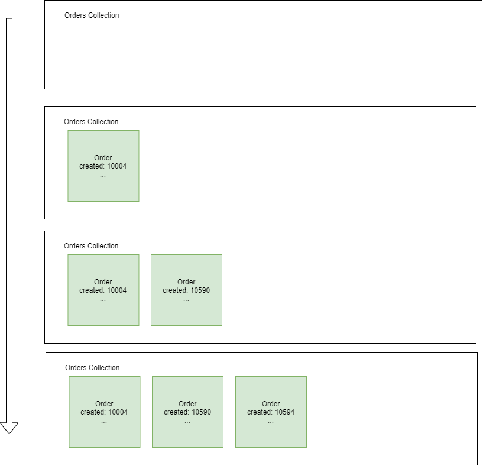

# Queue High Level Design


## enQueue 

1. Customer A calls **/enQueue** with drinkInfo 
```ts
 {
    base: "MilkTea"
    toppings: ["Boba"]
}
```
In this case, the **enQueue** method creates an Order object with a created time of 10004.


2. Customer B and C also makes a call to **/enQueue** with drinkInfo with times 10590 and 10594, respectively.

## Queue Visualization (Customer)

1. The Customer views the queue and under the hood **getTimeStamps** is called which retrieves all of the timestamps
of every active order and **getCustomerOrders** is also called which retrieves all of the customer's orders.  The list is sorted and matching timestamps
of the string array returned from **getTimeStamps** and **getCustomerOrders** identify the position in the queue of their orders.
This process is repeated for every change in the **Orders Collection**.

## Queue Visualization (Vendor)
1. The Vendor has full access to all Orders and calls **getAllOrders** which returns an array of Orders. Orders are sorted by the **created** field
and can be worked on by the vendor. This queue is updated for every change to the **Orders Collection**.


